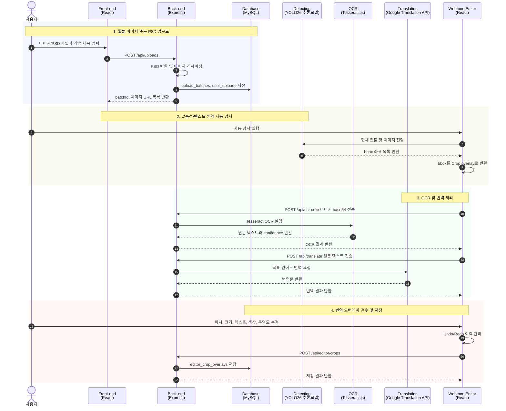
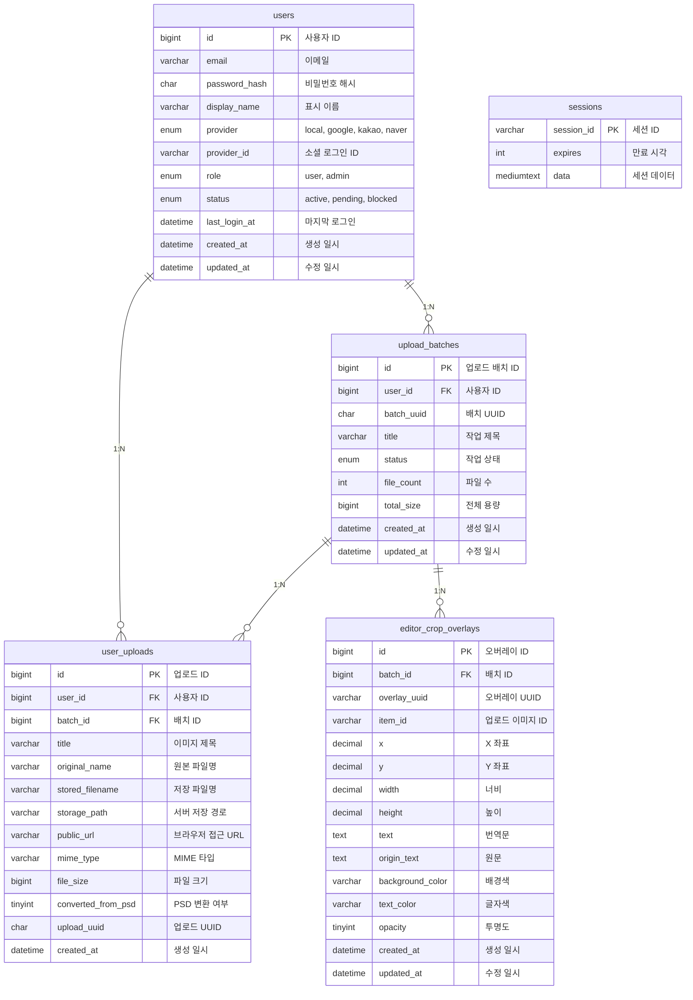

# 웹툰 자동번역 모듈

웹툰 이미지를 업로드하면 YOLO 객체 감지 모델로 말풍선·텍스트 영역을 자동으로 찾고, OCR로 원문을 추출한 뒤 Gemini 번역 API를 통해 번역합니다. 번역 결과는 편집 화면에서 바로 검수·수정할 수 있도록 구성했습니다
프론트엔드는 React와 TypeScript로 구현하고, 백엔드는 Express와 MySQL로 사용자 세션, 업로드 배치, 편집 오버레이 데이터를 관리했습니다. 이미지 업로드와 리사이징은 multer·sharp, PSD 변환은 ag-psd, OCR은 Tesseract.js, 말풍선 자동 감지는 YOLO26 추론모델을 사용했습니다.

---

## 시퀀스 다이어그램

---

## 시연 자료

## 시연 사이트
http://221.154.120.167:3002/

---

## ERD

---

## 기술 스택

**프론트엔드**

**백엔드**

**이미지/OCR/번역**

**데이터 저장**

**기타**

---

## 외부 API/라이브러리 연동 및 주요 인프라 기능

- **YOLO26 추론모델 말풍선 감지**: 웹툰 이미지를 1200px 단위로 나눠 모델에 전달하고, 반환된 bbox 좌표를 편집 오버레이 좌표로 변환
- **Tesseract.js OCR**: Crop 영역의 base64 이미지를 서버로 전달해 원문 텍스트와 confidence 추출
- **Google Translation API**: OCR 원문을 목표 언어로 번역하고, API 호출 간격을 큐로 제어
- **PSD 변환 및 이미지 리사이징**: `ag-psd`로 PSD 이미지 데이터를 읽고 `sharp`로 PNG 변환 및 1000px 기준 리사이징
- **MySQL 작업 저장소**: 사용자, 업로드 배치, 업로드 파일, 편집 오버레이, 세션 데이터 저장
- **Express Static Data Serving**: `/data/uploads/{filename}` 경로로 업로드 이미지를 브라우저에 제공
- **Undo/Redo 편집 이력**: Crop overlay 좌표, 텍스트, 색상, 투명도 변경을 프론트엔드 상태에서 관리
